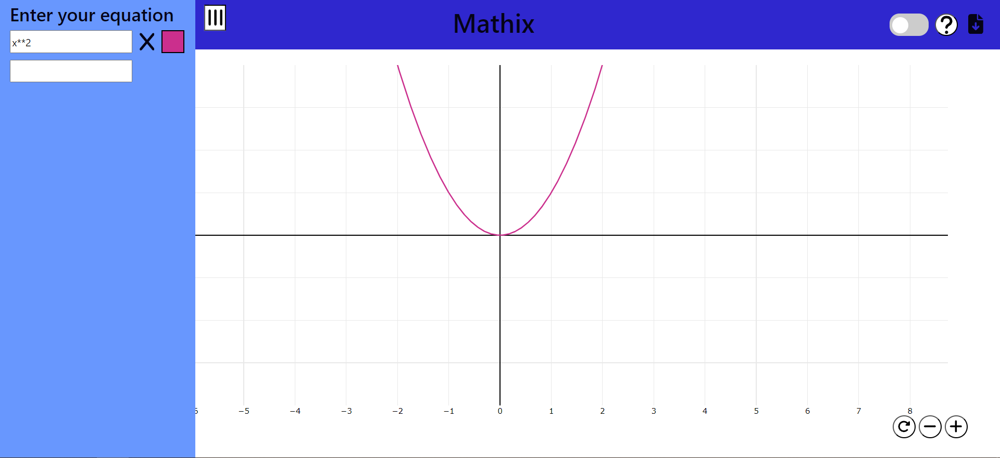

# Graphing-Calculator

# Table of Contents

- [Graphing-Calculator](#graphing-calculator)
- [Table of Contents](#table-of-contents)
  - [Description](#description)
  - [Installation](#installation)
    - [1. Clone the Repository](#1-clone-the-repository)
    - [2. Run frontend server](#2-run-frontend-server)
  - [Contributing](#contributing)
  - [License](#license)

## Description

[Graphing-calculator Website](https://vasya-556.github.io/Graphing-calculator/)  
This is a webapp graphing calculator written on ReactJs. 


## Installation

Follow these steps to get started
### 1. Clone the Repository
```bash
git clone https://github.com/Vasya-556/Graphing-calculator
cd Graphing-calculator
```

### 2. Run frontend server
```bash
cd frontend
npm start
```

## Contributing

Pull requests are welcome.

## License

[MIT](LICENSE)